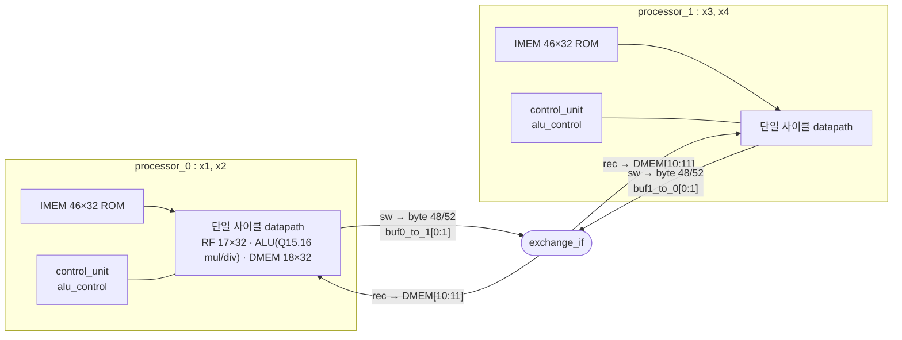
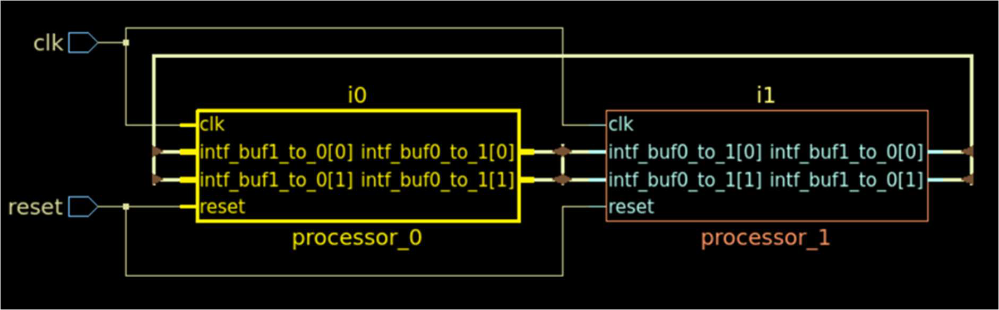
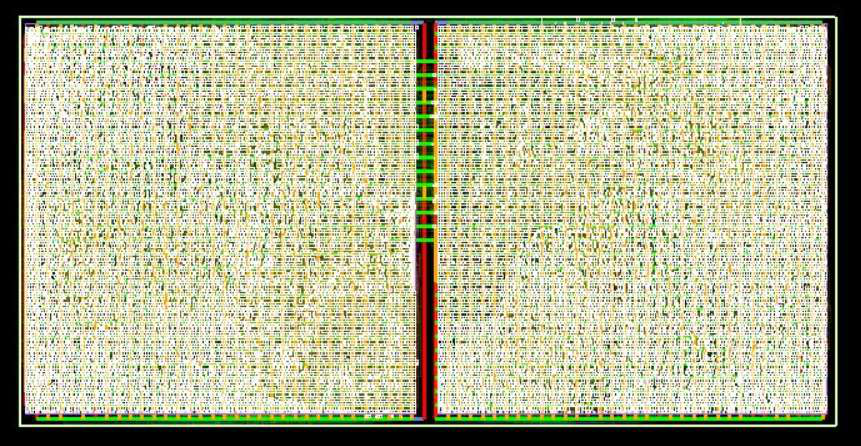
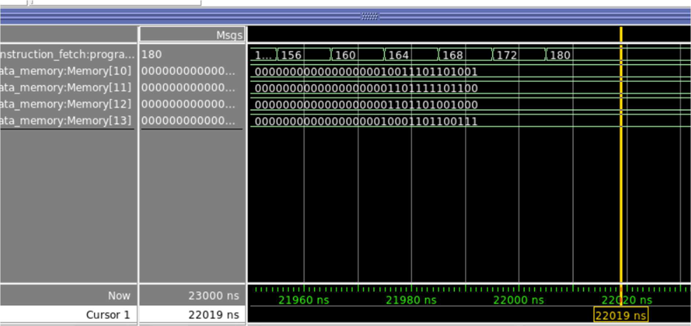

# Jacobi Iteration Dual-Core CPU

4×4 선형 시스템 `Ax = b`를 자코비 반복법으로 푸는 **MIPS 기반 단일 사이클 듀얼코어 CPU**입니다. 두 코어가 행을 2개씩 나눠 계산하고, 매 반복 끝에 커스텀 명령 `rec`로 해 벡터의 절반을 서로 교환합니다.

- SystemVerilog · ModelSim · Oasys(합성) · Nitro-SoC(P&R)
- Verilator로 검증했습니다. 원본 코드와 재검증에서 추가·수정한 부분은 [원본 대비 변경 사항](#원본-대비-변경-사항)에 구분해 두었습니다.

## 핵심 결과

| 항목 | 값 | 출처 |
|---|---|---|
| 연산 결과 | 50회 반복 후 x1..x4 = 10089 / 7148 / 6984 / 9063 (Q15.16). 비트 단위 골든 모델과 전 반복 일치 | `make check` |
| 정확도 | 해석해 대비 오차 최대 1.15×10⁻⁵ (Q15.16 1 LSB = 1.53×10⁻⁵ 미만) | `make golden` |
| 처리량 | 반복당 44 cycle (CPI 1, 코어당 44 명령). reset 해제 후 End 도달까지 2,201 cycle | `make check` |
| 합성 면적 | 1,837,822 µm², 37,980 cells (코어당 약 919K µm²) | 보고서, Oasys `report_area` |
| 전력 | 8.71 mW (코어0 4.50 mW, 코어1 4.21 mW, 누설 10 µW) | 보고서, Oasys `report_power` (동작 조건 기록 없음) |
| div 명령 지연 | 2.624 ns (clk 상승 → 목적 레지스터 반영) | 보고서, 게이트 레벨 시뮬레이션 1건 관측치. STA 기반 Fmax 아님 |
| STA 재분석 (2026) | 크리티컬 패스는 조합 64-bit 나눗셈기: div → RF 54.03 ns (Nangate45 typ, Fmax 18.5 MHz) | [`docs/sta_reanalysis.md`](docs/sta_reanalysis.md), 공개 라이브러리 기준이라 절대값은 비교용 아님 |
| 개선: 역수 곱셈 (2026) | 나눗셈을 1/a_ii 곱셈으로 바꾸고 나눗셈기 제거 → 제약 없는 STA 최악 경로 55.38 → 6.70 ns (**8.3×**), 면적 −32%. 사이클 수 동일, 결과는 x4만 1 LSB 차이 | [`variants/recip.patch`](variants/recip.patch), `make check VARIANT=recip` |
| 개선: 5단 파이프라인 (2026) | forwarding · load-use stall · 분기 flush. 반복당 51 cycle, 랜덤 초기화 10 seed PASS. 버퍼링·배치 후 주기 2.77 → 2.39 ns지만 반복 1회 시간은 121.7 → 121.9 ns로 **비슷함** (병목은 곱셈기) | [`variants/pipe/`](variants/pipe/), `make check VARIANT=recip+pipe` |
| 버퍼링까지 한 재측정 (2026) | OpenROAD 배치 · repair_design · CTS · repair_timing. 반복 1회 시간 원본 1,839 ns → 최선 121.7 ns (**15.1×**) | [`syn/pnr.tcl`](syn/pnr.tcl), `make pnr` |

## 구조



- **분할**: 코어0은 1·2행(x1, x2), 코어1은 3·4행(x3, x4)을 계산합니다. 각 코어는 자기 행의 계수 `a_ij`, `b_i`만 로컬 data memory에 들고 있습니다.
- **교환**: `x(k) ← x(k+1)`을 커밋하는 `sw`가 byte 주소 48/52에 쓰면 data memory가 같은 값을 교환 버퍼에도 씁니다. 이어서 `rec`가 상대 버퍼를 DMEM[10:11]로 복사합니다. 핸드셰이크는 없고, 두 코어가 같은 길이의 프로그램을 같은 사이클에 실행한다는 **lockstep 전제**로 동기화됩니다.
- **자코비 조건**: x2(k+1)을 계산할 때도 x1은 갱신 전 값(DMEM[12])을 읽도록 결과를 DMEM[14:15]에 따로 저장했다가 한 번에 커밋합니다. Gauss-Seidel이 아니라 자코비입니다.

### 반복 1회의 명령 흐름 (두 코어 동일 PC)

| PC (byte) | 명령 | 동작 |
|---|---|---|
| 8 – 68 | lw×8, mul×3, add×2, sub, div, sw | 첫 번째 담당 행 계산 → DMEM[14] |
| 72 – 132 | 동일 | 두 번째 담당 행 계산 → DMEM[15] |
| 136 – 148 | lw/sw ×2 | x(k) ← x(k+1) 커밋, 교환 버퍼 기록 |
| 152 | `rec` | 상대 코어 결과 → DMEM[10:11] |
| 156 – 172 | lw, addi, sw, lw, beq | 반복 카운터 증가, 한계(DMEM[17]) 비교 |
| 176 | `j` | PC 4로 복귀 |

### ISA

MIPS I 포맷을 따르되 아래가 다릅니다. 전체 인코딩은 [`sw/asm.py`](sw/asm.py) 주석 참고.

| 명령 | 인코딩 | 비고 |
|---|---|---|
| `add sub and or slt` | R, opcode 0 | MIPS와 동일 funct |
| `mul` / `div` | R, funct `100001` / `100011` | Q15.16. `mul`: 64-bit 곱 `>>> 16`, `div`: `(A <<< 16) / B`, 0으로 나누면 0 |
| `lw sw addi beq` | I | `lw/sw` 오프셋은 바이트 단위 |
| `j` | J | 26-bit 필드를 **바이트 주소**로 해석: `{PC+4[31:28], field[25:2], 2'b00}` |
| `rec` | opcode `010101` | 상대 코어 교환 버퍼 → DMEM[10:11] |

레지스터는 `$zero`=r0, `$tN`=r(N+1)로 17개(`Registers[0:16]`)입니다.

### Data memory 맵 (코어0 기준, 코어1은 3·4행)

| 주소 (word) | 내용 | 주소 (word) | 내용 |
|---|---|---|---|
| 0–3 | a11 a12 a13 a14 | 12, 13 | x1(k), x2(k) → 교환 버퍼 |
| 4–7 | a21 a22 a23 a24 | 14, 15 | x1(k+1), x2(k+1) |
| 8, 9 | b1, b2 | 16 | 반복 카운터 |
| 10, 11 | x3(k), x4(k) ← `rec` | 17 | 반복 한계 (테스트벤치에서 50) |

## 검증

### 원본 (2025)
- ModelSim에서 `processor_0/1`에 immediate assertion을 넣어 MUL/DIV/REC 실행, 반복 횟수, 종료 PC를 로그로 추적했습니다.
- 1·2·50회차 x1..x4를 손으로 계산한 이론값과 비교했습니다.

### 재검증 (2026, 이 레포에서 추가)

| 항목 | 방법 | 결과 |
|---|---|---|
| 골든 모델 | [`model/jacobi_golden.py`](model/jacobi_golden.py): RTL과 같은 순서·같은 반올림으로 Q15.16 연산을 재현 | 보고서의 1·2·50회차 값과 일치 |
| 반복별 비교 | [`tb/top_tb_selfcheck.sv`](tb/top_tb_selfcheck.sv): 50회 × 코어별 결과 4 word + 교환받은 사본 4 word 비교 | 불일치 0 |
| lockstep | 매 사이클 두 코어 PC 동일 여부 검사 | 위반 0 |
| fetch 범위 | 매 사이클 PC가 IMEM(0–180) 안에 있는지 검사 | 수정 후 위반 0 |
| 이벤트 수 | 코어당 MUL 300 / DIV 100 / REC 50 (= 6·2·1 × 50회) | 일치 |
| 초기값 무관성 | `--x-initial unique`, seed 5개 | 5/5 PASS |
| 원본 RTL 대조 | 같은 검사를 첫 커밋의 RTL로 실행 | FAIL: 50회차 분기 후 PC 896으로 IMEM 이탈, 반복 카운터 50 초과. 1~50회차 값은 전부 일치 |
| 명령 인코딩 | [`sw/asm.py`](sw/asm.py)로 `sw/core*.s`를 다시 어셈블해 ROM 92 word와 비교 | 수정 후 불일치 0 |

## 원본 대비 변경 사항

첫 커밋이 제출 당시 원본 그대로이고, 이후 커밋에서 아래만 바꿨습니다.

| 파일 | 변경 | 이유 |
|---|---|---|
| `rtl/instruction_memory_{0,1}.sv` `Memory[43]` | `beq` imm `180` → `1` | **버그 수정.** 분기 주소는 `PC+4 + (imm<<2)`이므로 imm 180이면 `176 + 720 = 896`으로 IMEM(0–180) 밖으로 분기합니다. 50회차 결과는 분기 직전에 이미 저장돼 있지만, 이후 End로 가지 않고 IMEM 밖(896, 900, …)을 fetch합니다. Verilator(2-state)에서는 인덱스가 잘려 ROM 중간부터 다시 실행되고 반복 카운터가 51 이상으로 넘어갑니다. 보고서 파형에는 172 → 180으로 정상 종료가 찍혀 있으나, 문서로 남은 코드로는 재현되지 않습니다 |
| `rtl/SCDP_without_control_unit_{0,1}.sv` | `exchange_if intf` → `exchange_if.core0/core1 intf` | 툴 호환. Verilator 5.x는 generic interface 포트에 modport 연결을 허용하지 않음. 동작 변화 없음 |
| `tb/top_tb_selfcheck.sv`, `model/`, `sw/`, `Makefile` | 신규 | 재검증용 |

## 알려진 한계와 개선 방향

| 항목 | 현상 | 개선안 |
|---|---|---|
| 고정 반복 횟수 | 수렴 판정 없이 50회 고정. Q15.16 해는 **12회차 이후 변하지 않아** 이후 38회(1,672 cycle)는 결과에 기여하지 않음 | `x(k+1) == x(k)` 또는 `|Δx| < ε` 검사로 조기 종료. 검사 명령 오버헤드를 빼면 2,200 → 572 cycle(13회) 수준으로 추정 |
| 병렬화 이득 | 단일 코어 기준 구현이 없어 실측 speedup 없음 | 명령 수로 추정하면 단일 코어 79 vs 듀얼 44 명령/반복 → 약 1.8×. 2×에 못 미치는 원인은 루프 제어 7명령과 `rec`가 코어마다 중복되기 때문 |
| ALU 면적·타이밍 | 조합 64-bit 곱셈·나눗셈이 코어 면적의 61% (560,661 / 919,363 µm²). STA 재분석에서 div 경로 54.03 ns로 다음 병목 mul(7.29 ns)의 7.4배 | **적용함 (`variants/recip.patch`)**: `a_ii`는 상수이므로 `1/a_ii`를 미리 저장하고 `div`를 `mul`로 대체, 나눗셈기 제거 → 55.38 → 6.70 ns, 면적 −32% |
| 분기 경로 | `zero`를 ALU 결과 mux 뒤에서 계산해, 쓰이지 않는 div → zero → PC 경로가 STA 최악 경로(55.38 ns)로 잡힘 | `zero`를 전용 비교기(`A == B`)로 분리: beq 경로 6.92 → 5.13 ns, 기능 동일 확인 ([STA 재분석](docs/sta_reanalysis.md)) |
| 동기화 | 핸드셰이크 없이 lockstep에 의존. 두 코어의 명령 수가 달라지면 이전 반복 값을 읽음 | valid 비트 또는 barrier 명령. 재검증 TB에서는 매 사이클 PC 비교로 전제를 명시 |
| `bne` | control_unit이 `beq`와 같은 신호를 내서 `bne`도 zero일 때 분기 | 프로그램에서 미사용. branch 종류를 구분하는 제어 신호 추가 필요 |
| `$zero` | 하드와이어가 아님. 리셋 중 명령이 `0x00000000`으로 강제되고 이것이 `rd=0` R-type으로 디코드되어 r0에 0이 기록되는 암묵적 동작에 의존 | r0 쓰기 금지·읽기 0 고정 |
| ALU lint | `always_comb`에서 `wide_mul`, `wide_dividend`가 일부 경로에서 미할당 → Verilator LATCH 경고 (합성 후 latch는 0개) | 블록 시작에서 기본값 할당 |
| 원본 assertion | `assert (cond) $display(...)`를 조건 트레이스 용도로 써서, 조건이 거짓인 사이클마다 `Assertion error`가 출력됨 | 재검증 TB에서 이벤트 카운터와 불변식 검사(lockstep, fetch 범위)로 분리 |
| 확장성 | 4×4, 2코어, 주소가 명령에 하드코딩 | 행 수를 파라미터화하고 base 레지스터 기반 주소 지정 |

## STA 재분석 (2026, 프로젝트 종료 후 추가 연구)

보고서의 "div 지연 2.624 ns"가 Fmax 근거가 될 수 있는지 확인하려고, 원본 RTL을 공개 툴체인(sv2v → Yosys → OpenSTA, Nangate45 slow/typ/fast)으로 다시 합성하고 STA를 했습니다. 명령어 종류별로 case analysis와 false path 제약을 걸어, 실제로 신호가 타는 경로와 구조상으로만 긴 경로를 나눠 봤습니다. 과정과 막혔던 점은 [`docs/sta_reanalysis.md`](docs/sta_reanalysis.md)에 정리했습니다.

| 경로 (typ, ns) | 원본 | zero 전용 비교기 | **역수 곱셈 (recip)** | recip + zero 비교기 |
|---|---:|---:|---:|---:|
| 제약 없이 본 최악 경로 | 55.38 | 55.19 | **6.70** | 6.68 |
| 명령어별 최악 | 54.79 (div) | 54.57 (div) | 6.44 (mul) | 6.43 (mul) |
| div → RF, 직접 경로 | **54.03 (18.5 MHz)** | 53.99 | 나눗셈기 없음 | 나눗셈기 없음 |
| mul → RF, 직접 경로 | 7.29 | 7.29 | 5.86 | 5.94 |
| beq → PC | 6.92 | **5.13** | 5.94 | 4.62 |
| cells / 면적 (µm²) | 34,849 / 50,386 | 35,018 / 50,419 | **21,848 / 34,322** | 21,795 / 34,259 |
| 반복 1회 (44 cycle × 최악 경로) | 2.44 µs | 2.43 µs | **0.295 µs** | 0.294 µs |

- 원본의 Fmax는 조합 나눗셈기가 결정합니다. 54 ns 중 49 ns가 나눗셈기 한 블록이라, CPU를 파이프라인으로 나눠도 그 단계가 약 50 ns로 남습니다.
- 그래서 먼저 **나눗셈을 없앴습니다(recip)**. a_ii는 반복 내내 상수이므로 1/a_ii(Q15.16)를 대각 원소 자리에 미리 저장하고, 코어당 `div` 2개를 `mul`로 바꾼 뒤 ALU에서 나눗셈기를 제거했습니다. 제약 없는 최악 경로가 **8.3배** 짧아지고 면적은 32% 줄었습니다.
  - 사이클 수(End까지 2,201)는 그대로입니다. 결과는 x4만 9063 → 9064로, 정확한 해와의 오차가 0.75 → 0.25 LSB로 오히려 줄었습니다.
  - self-check TB의 50회 반복 전 구간과 랜덤 초기값 3 seed가 모두 PASS입니다.
- recip 이후 합성 직후 기준으로는 mul 직접 경로(5.86 ns)의 약 46%를 명령어 ROM 디코드(약 2.7 ns)가 차지했습니다. 하지만 이 합성 흐름은 fanout 버퍼링을 하지 않아 디코드 지연이 부풀려져 있었고, 버퍼링까지 한 재측정(아래)에서는 병목이 곱셈기로 나왔습니다.
- 일반 STA의 최악 경로는 div 실행 중에는 쓰이지 않는 div → zero → PC false path였습니다. zero를 전용 비교기로 분리하면 이 경로가 사라지고 beq가 26% 짧아집니다. self-check TB로 기능이 같음을 확인했습니다.
- 45 nm typ에서도 나눗셈기 최악 지연이 약 54 ns라서, 보고서의 2.624 ns는 특정 피연산자에서 관측된 값으로 봐야 합니다.
- 전체 corner·명령어별 결과는 [`syn/results/`](syn/results/)에 있습니다.

### 파이프라인과 버퍼링까지 한 재측정

합성 직후 STA는 fanout 버퍼링과 사이징이 없는 넷리스트 기준입니다. max slew/cap 위반이 수백 개라 수치가 부풀려져 있습니다. 그래서 같은 넷리스트를 OpenROAD로 배치하고, repair_design → CTS → repair_timing(목표 2.0 ns, 원본은 40 ns)을 거친 뒤 다시 쟀습니다. 5단 파이프라인(`variants/pipe/`)도 이 기준으로 비교했습니다.

| 설계 (typ) | 합성 직후 T_min | 수리 후 T_min | cycle/반복 | 반복 1회 | 면적 (µm²) |
|---|---:|---:|---:|---:|---:|
| 원본 | 55.38 ns | 41.79 ns | 44 | 1,839 ns | 57,295 |
| recip + zero 비교기 | 6.68 ns | 2.77 ns | 44 | **121.7 ns** | 39,573 |
| recip + zero 비교기 + 5단 파이프라인 | 3.53 ns | **2.39 ns** | 51 | 121.9 ns | 43,772 |

- 합성 직후만 보면 파이프라인이 주기를 1.9배 줄이는 것처럼 보였습니다. 버퍼링 후에는 1.16배(2.77 → 2.39 ns)입니다. 사이클 증가(+7: load-use stall 6, `j` flush 1)까지 넣으면 반복 1회 시간은 단일 사이클과 비슷하고, 면적은 +11%입니다.
- 파이프라인의 최악 경로는 MEM/WB → forwarding → 32×32 곱셈기 → EX/MEM입니다. 파이프라인이 효과를 보려면 곱셈기를 2단으로 나눠야 합니다.
- 파이프라인 검증 중, 랜덤 초기화 회귀에서 동기 리셋 파이프라인이 리셋 중 첫 엣지에 DMEM을 쓰는 버그를 찾아 고쳤습니다(쓰기 enable을 reset으로 qualify).
- 같은 측정을 상용 툴(Genus/Innovus/Tempus, gsclib045)로 하는 스크립트는 [`syn/cadence/`](syn/cadence/)에 있습니다. 아직 실행 전입니다.

## 합성 · P&R (보고서 기준)

Oasys `report_area`

| Instance | Module | Cells | Area (µm²) |
|---|---|---:|---:|
| top | | 37,980 | 1,837,822 |
| i0 | processor_0 | 18,999 | 919,363 |
| └ alu | alu | 14,577 | 560,661 |
| └ data_memory | data_memory_0 | 1,953 | 176,724 |
| └ register_file | register_file | 2,139 | 168,005 |
| └ instruction_fetch | instruction_fetch_0 | 226 | 8,346 |
| i1 | processor_1 | 18,981 | 918,459 |

Oasys `report_power`

| Instance | Internal (µW) | Switching (µW) | Leakage (µW) | Total (µW) |
|---|---:|---:|---:|---:|
| i0 | 1,297.9 | 3,193.2 | 4.96 | 4,496.1 |
| i1 | 1,274.1 | 2,933.2 | 4.99 | 4,212.3 |
| Total | 2,572.0 | 6,126.5 | 9.96 | 8,708.4 |

| 넷리스트 (top) | P&R 레이아웃 |
|---|---|
|  |  |

50회차 종료 시점 파형 (코어1 DMEM[10:13] = x1, x2, x3, x4):



## 실행

Verilator 5.x와 Python 3가 필요합니다. Icarus Verilog는 interface/modport 지원이 부족해 쓰지 않습니다.

```bash
make check         # 골든 모델 생성 + self-checking TB → RESULT: PASS/FAIL
make check-random  # 랜덤 초기 상태 5 seed
make asm-check     # sw/*.s 재어셈블 → ROM 비교
make golden        # 반복별 수렴 표
make wave          # build/wave.vcd
make sim           # 원본 테스트벤치(검사 없음)
make lint
make sta-tools && make sta   # STA 재분석 (Yosys + OpenSTA, 합성 ~45분)
make check VARIANT=recip     # 개선 변형 검증 (variants/*.patch, + 로 조합: recip+zero_cmp)
make sta VARIANT=recip       # 개선 변형 STA (나눗셈기가 없어 수 분)
make check VARIANT=recip+zero_cmp+pipe     # 5단 파이프라인 (variants/pipe/)
make pnr-tools && make pnr VARIANT=recip+zero_cmp+pipe PERIOD=2   # OpenROAD (make sta 이후)
make check RTL_DIR=<dir>   # 다른 RTL 트리(예: 원본 커밋 checkout)로 같은 검사
```

## 디렉터리

```
rtl/     원본 RTL (processor_*, SCDP_*, instruction_*, data_memory_*, alu*, control_unit, exchange_if, top)
tb/      top_tb.sv (원본), top_tb_selfcheck.sv (재검증)
model/   Q15.16 골든 모델
sw/      core0.s, core1.s, asm.py
syn/     STA 재분석 흐름 (flow.sh, syn.ys, sta_mode.tcl), OpenROAD (pnr.tcl), cadence/, results/
variants/ 개선 변형 (zero_cmp.patch, recip.patch, pipe/ 5단 파이프라인)
docs/    design_history.md (버전 이력, 교환 방식 결정), sta_reanalysis.md, images/
```

## 담당

Main Control Unit, Single-Cycle Datapath, 테스트벤치, 어셈블리 → 명령어 인코딩
